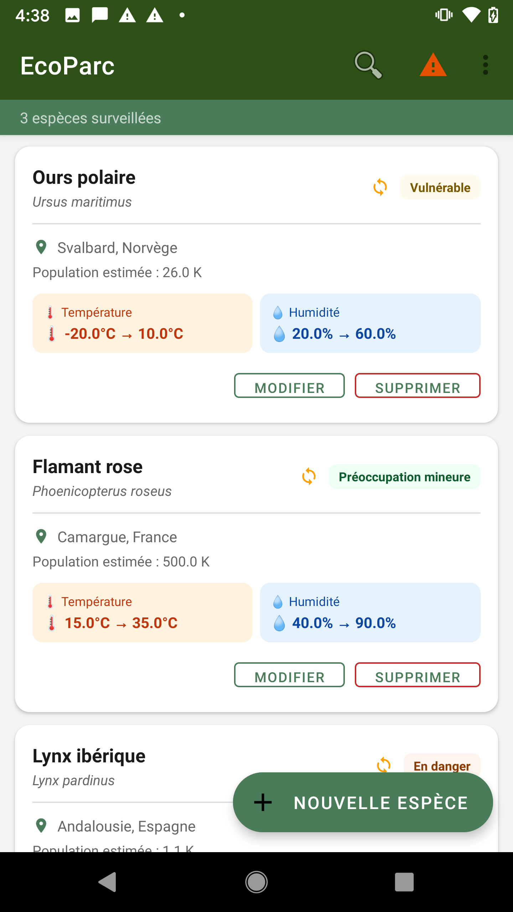
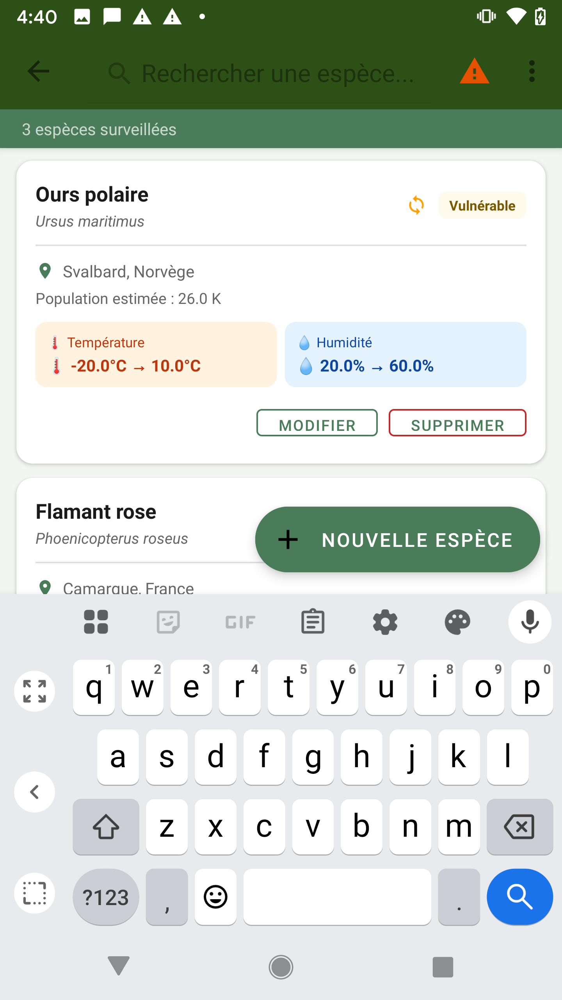
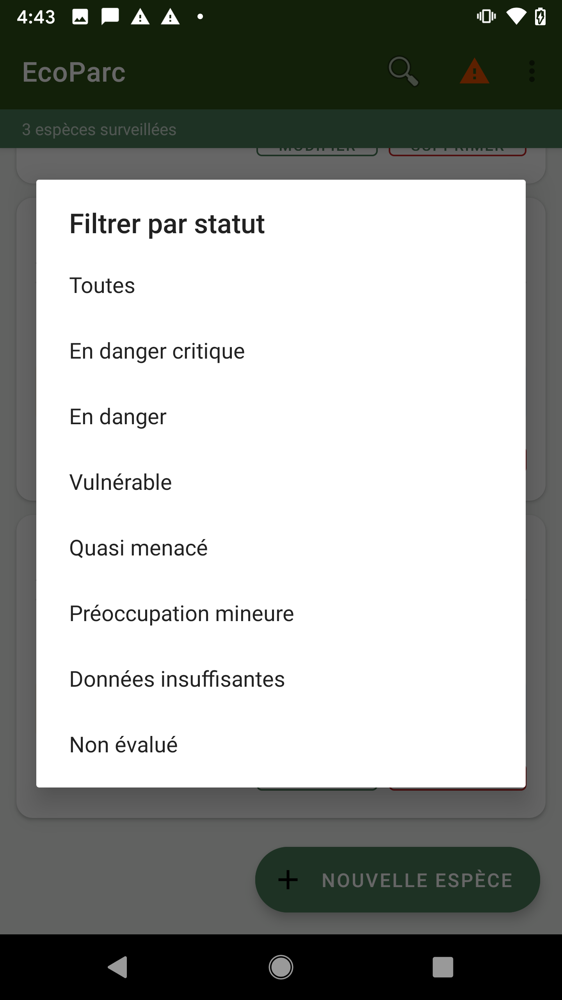
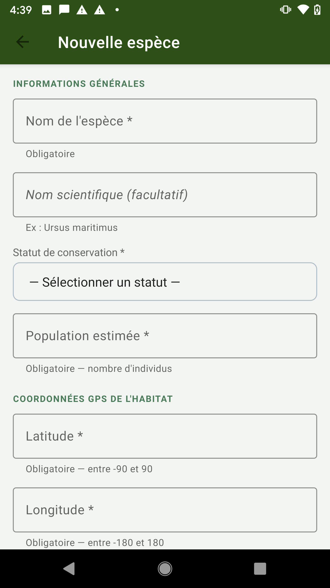
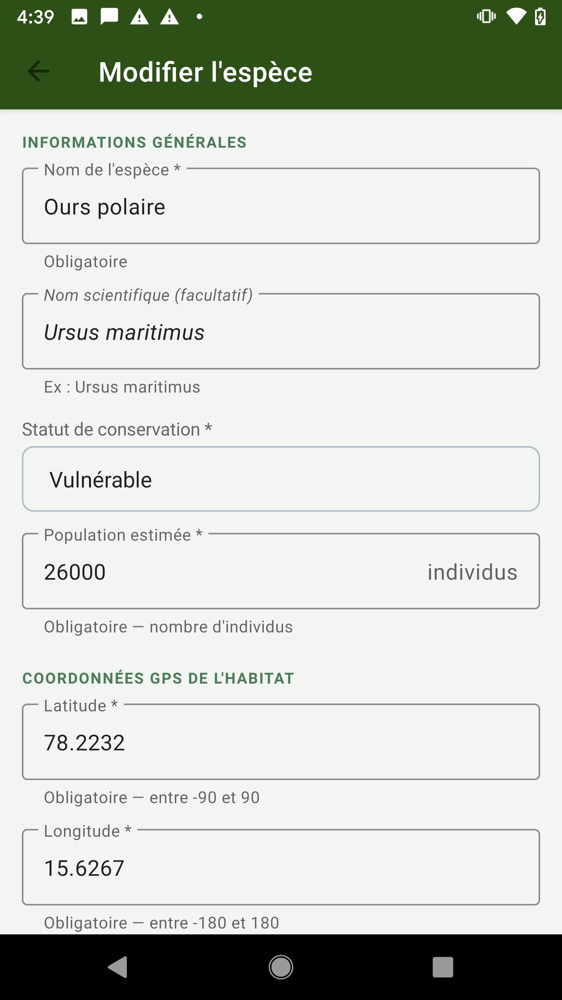
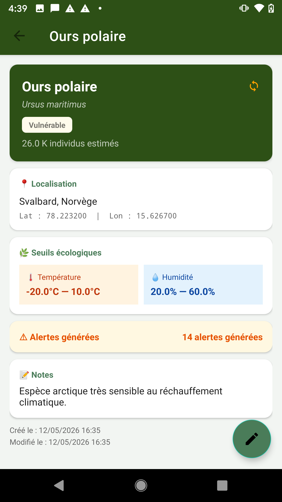
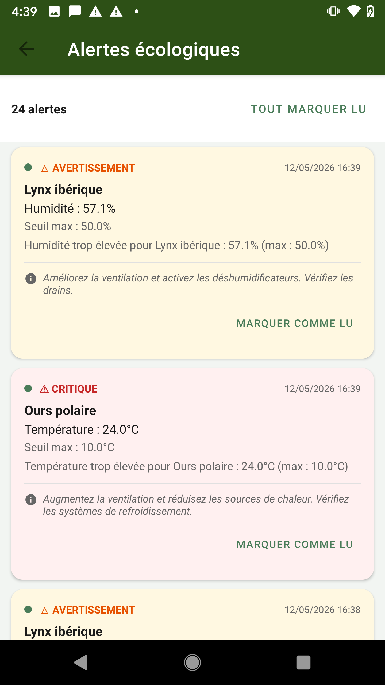

# EcoParcApp — Ecological Monitoring of Natural Parks
**Kotlin • Room SQLite • Firebase Firestore • GPS • Sensors • Notifications**
**Compatible: Android Studio Hedgehog+ • JDK 17 • Gradle 8.2 • AGP 8.1.4**

---

## Required Android Studio Configuration

| Setting               | Value                     |
|-----------------------|---------------------------|
| Gradle JDK            | **JDK 17** (jdk-17)       |
| Gradle version        | 8.2                       |
| Android Gradle Plugin | 8.1.4                     |
| Kotlin                | 1.9.10                    |
| compileSdk / targetSdk| 34                        |
| minSdk                | 24 (Android 7.0)          |

> **Important:** In Android Studio → File → Project Structure → SDK Location,
> make sure "Gradle JDK" is set to **jdk-17**.

---

## Project Structure

```
app/src/main/java/com/ecoparc/
├── data/
│   ├── model/        Espece.kt  Alerte.kt
│   ├── local/        EcoParcDatabase.kt  EspeceDao.kt  AlerteDao.kt
│   ├── remote/       FirebaseDataSource.kt
│   └── repository/   EspeceRepository.kt
├── ui/
│   ├── main/         MainActivity  MainViewModel  EspeceAdapter
│   ├── form/         EspeceFormActivity  EspeceFormViewModel
│   ├── detail/       EspeceDetailActivity  EspeceDetailViewModel
│   └── alerts/       AlertsActivity  AlertsViewModel  AlerteAdapter
└── service/          MonitoringService.kt
```

---

## Getting Started

### 1. Firebase (required for remote synchronization)
1. Go to [console.firebase.google.com](https://console.firebase.google.com)
2. Create a project named **EcoParcApp**
3. Add an Android app with the package `com.ecoparc`
4. Download `google-services.json` → replace `app/google-services.json`
5. In Firestore → create the `especes` collection → test mode:
```
rules_version = '2';
service cloud.firestore {
  match /databases/{database}/documents {
    match /{document=**} {
      allow read, write: if true;
    }
  }
}
```

### 2. Open in Android Studio
1. **File → Open** → select the `EcoParcApp/` folder
2. Wait for Gradle sync to complete
3. If Gradle JDK error: **File → Project Structure → SDK Location → Gradle JDK → jdk-17**
4. **Build → Make Project**
5. Run on a device with API 24+ or an emulator

### 3. Permissions requested at launch
- `ACCESS_FINE_LOCATION` — GPS
- `POST_NOTIFICATIONS` — push alerts (Android 13+)

---

## Features

### 1. Data Management
- Species list with RecyclerView + DiffUtil
- Each item: **name**, scientific name, **GPS address**, **IUCN status** badge, min/max temperature, min/max humidity, population
- Real-time search (name, status, address)
- Filter by conservation status
- Swipe left/right to delete
- 3 pre-loaded species on first launch

### 2. Form Validation
- Required fields (`*`) vs optional fields
- **Real-time** field-by-field validation
- Cross-field business checks: max temp > min temp, humidity 0–100%, lat [-90,90], lon [-180,180]
- Error message displayed below each invalid field

### 3. Local Database — Room (SQLite)
- Tables: `especes` + `alertes` (foreign key with CASCADE)
- Data preserved **offline**
- Sync status per record

### 4. External Database — Firebase Firestore
- Offline-first strategy: immediate local save
- Background Firebase sync (create / update / delete)
- ⏳ indicator on items not yet synchronized

### 5. Built-in Sensors
- Reads `TYPE_AMBIENT_TEMPERATURE` and `TYPE_RELATIVE_HUMIDITY`
- Realistic simulation when sensors are unavailable (emulator)
- Check every 30 seconds

### 6. GPS and Geocoding
- `FusedLocationProviderClient` → current location
- `Geocoder` → human-readable address (reverse geocoding)
- Raw coordinates displayed when offline

### 7. Alerts and Notifications
- `MonitoringService`: permanent foreground service
- **Monitoring** channel (quiet, persistent notification)
- **Alerts** channel (high priority, vibration)
- Levels: **Warning** / **Critical** (> 5°C or > 15% deviation)
- Action advice included in each notification

---

## Pre-loaded Species

| Species          | Min Temp | Max Temp | Min Humidity | Max Humidity |
|------------------|----------|----------|--------------|--------------|
| Polar bear       | -20°C    | 10°C     | 20%          | 60%          |
| Flamingo         | 15°C     | 35°C     | 40%          | 90%          |
| Iberian lynx     | 5°C      | 25°C     | 30%          | 50%          |

---

## 📸 Screenshots

### 🗺️ Species List

#### Dashboard


#### Search


#### Filter by Status


---

### ➕ Species Management

#### Add Species


#### Edit Species


---

### 📋 Species Detail

#### Species Details


---

### 🔔 Notifications

#### Notifications


---

*Mobile Application Development 2 — Final Project*
